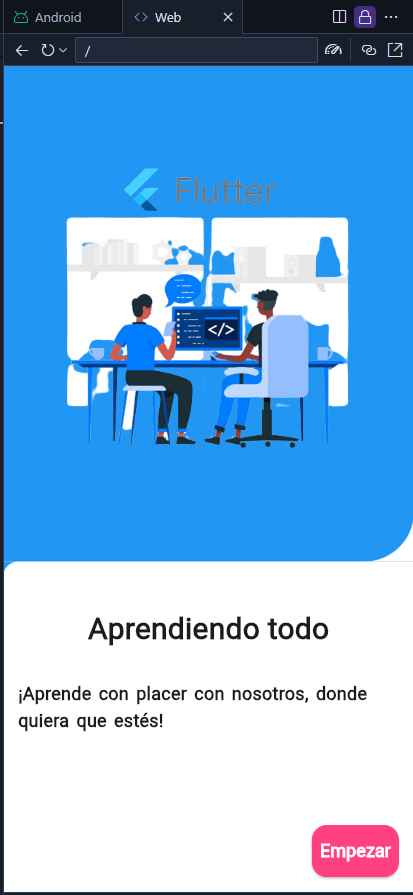

## Pagina Oficial flutter

[Basic widgets](https://docs.flutter.dev/ui/widgets/basics)

[Online Dart DEV](https://dartpad.dev/)

## salida primera parte disenio 1 

## SafeArea
- [Beginning Flutter - Intermediate - Using Common Widgets](https://youtu.be/WOvj84xq_fc?si=2K7FjWhs-wMTrlMh)

[Flutter — Row/Column Cheat Sheet](https://medium.com/jlouage/flutter-row-column-cheat-sheet-78c38d242041)

## Container Filas y columnas video
- [Flutter Row, Column, and Expanded Widget in Flutter](https://youtu.be/wzcJXTmxlWo?si=IFzEfmTsBPV1TxU8)

- [Flutter: Uso de Row y Column para organizar widgets](https://youtu.be/rL1N4aymJlU?si=-mdVhUywU80KirFH)
- [Como crear un Container, Columns y más de Flutter](https://youtu.be/XctK7kMtOpk?si=mr6JOLmuSrFu1i0z)

- [Aprende todo sobre el Widget CONTAINER con FLUTTER](https://youtu.be/7g_rCRLau9E?si=jLaJpTrLzdJyl02n)

## container BoxDecoration

[The Distinctive Guide to Flutter BoxDecoration for Exquisite UIs](https://www.dhiwise.com/post/guide-to-flutter-boxdecoration-for-exquisite-uis)

- [Flutter Container with challenges](https://alfonso-software.medium.com/flutter-container-with-challenges-b7b5c05f0b73)

## Spacer
[Spacer Class In Flutter](https://medium.flutterdevs.com/spacer-class-in-flutter-2f3b97cb3cb9)
## github + video
[e_learning_app](https://github.com/umairdev1/e_learning_app.git)
[Flutter E Learning App](https://youtu.be/djcD2NZwXAc?si=NjyGPgJO_GAt3ML4)

- otro
[Exploring Flutter Layout Widgets: Expanded and Flexible](https://medium.com/@ramantank04/exploring-flutter-layout-widgets-expanded-and-flexible-e384b351815)

[Flutter 22: Exploring Flutter layout widgets: Expanded and Flexible](https://youtu.be/48lp6DTWq6k?si=5-iPPYc-i8Mvw0PS)

[CONTAINER Y BOXDECORATION EN FLUTTER](https://youtu.be/8M6Jl6WYRag?si=rFkVt3VzlO_icCNZ)
